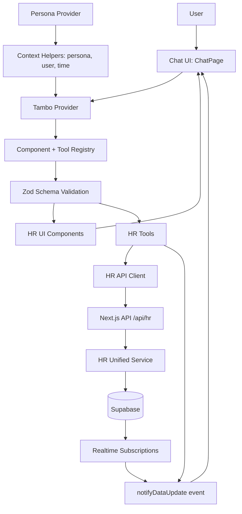

# Zoho People AI: Agentic Generative UI

An intent-driven HR workspace that reimagines how employees, managers, and HR admins complete routine tasks. This app uses Tambo to render pre-registered UI components based on persona, intent, and context.

## Problem Statement

Enterprise HR tools like Zoho People expose powerful features through complex, module-driven interfaces. Users must remember where actions live, leading to navigation overhead, repeated errors, and missed workflows (checkouts, approvals, regularizations).

## Solution (Generative UI)

We build a persona-aware operational layer where the AI selects and orchestrates pre-registered components instead of generating new UI. Chat is only for intent capture and clarification. All real actions happen through structured UI.

**Flow:**

```
User input -> persona -> intent -> context -> component selection -> render -> state update
```

## Intuition Behind The Design

Humans think in goals, not modules. The system flips the mental model from:

```
Menu -> submenu -> screen -> action
```

to:

```
Persona -> intent -> component -> action
```

Generative UI is bounded: the AI can only render components we register, keeping the experience safe, predictable, and auditable.

## Code Structure (What Lives Where)

- App entry and layout
  - [src/app/page.tsx](src/app/page.tsx) wires `PersonaProvider` + `TamboWrapper` + `ChatPage`.
  - [src/app/layout.tsx](src/app/layout.tsx) provides fonts and global styles.

- Persona and context
  - [src/contexts/PersonaContext.tsx](src/contexts/PersonaContext.tsx) loads persona profiles and maintains live user context.
  - [src/components/layout/TamboWrapper.tsx](src/components/layout/TamboWrapper.tsx) maps persona + context into Tambo `contextHelpers`.

- Generative UI registry
  - [src/lib/tambo.ts](src/lib/tambo.ts) registers **tools** (data ops) and **components** (renderable UI) with Zod schemas.
  - [src/components/hr](src/components/hr) contains persona-scoped HR UI components.
  - [src/components/tambo](src/components/tambo) contains chat and generative UI primitives.

- Data and backend
  - [src/app/api/hr/route.ts](src/app/api/hr/route.ts) is the HR API surface (GET/POST actions).
  - [src/services/hr-api-client.ts](src/services/hr-api-client.ts) is the client-side API wrapper used by tools.
  - [src/services/hr-unified.ts](src/services/hr-unified.ts) currently targets Supabase-backed services.
  - [src/services/supabase-hr](src/services/supabase-hr) contains the Supabase data access modules.
  - [src/data/store.json](src/data/store.json) and [src/services/hr-data.ts](src/services/hr-data.ts) provide JSON-backed mock data (not wired into the API route right now).

- Realtime updates
  - [src/lib/use-realtime-hr.ts](src/lib/use-realtime-hr.ts) subscribes to Supabase changes and dispatches a global `hr-data-updated` event.

## Internal Connections & Relations

- UI -> Tambo
  - `ChatPage` uses `useTambo()` to send messages and render the thread.
  - `TamboWrapper` injects `contextHelpers` (persona, user, time) into every prompt.

- Tambo -> Tools -> API
  - Tools registered in [src/lib/tambo.ts](src/lib/tambo.ts) call functions in [src/services/hr-api-client.ts](src/services/hr-api-client.ts).
  - The client hits [src/app/api/hr/route.ts](src/app/api/hr/route.ts) to perform data operations.

- API -> Data Layer
  - `route.ts` calls [src/services/hr-unified.ts](src/services/hr-unified.ts).
  - `hr-unified` calls Supabase modules in [src/services/supabase-hr](src/services/supabase-hr).

- State Refresh
  - `hr-api-client` and `use-realtime-hr` emit `hr-data-updated` so UI components can refresh without manual reloads.

## Architecture Diagram



## How To Run

1. Install dependencies

```
npm install
```

2. Configure environment

Copy [example.env.local](example.env.local) to `.env.local` and set:

- `NEXT_PUBLIC_TAMBO_API_KEY`
- `NEXT_PUBLIC_SUPABASE_URL`
- `NEXT_PUBLIC_SUPABASE_ANON_KEY`

3. Start the dev server

```
npm run dev
```

Open http://localhost:3000

## Using The App

- Switch personas from the top-right menu (Employee, Manager, HR Admin).
- Ask for common HR actions (leave request, approvals, attendance regularization).
- Use the Components sidebar to trigger exact UI components via curated prompts.

## Demo Scenarios

These are quick, end-to-end prompts to showcase the generative UI. Full checklist: [TEST_SCENARIOS.md](TEST_SCENARIOS.md).

- Employee: "I forgot to check out yesterday. Please regularize at 6:30 PM."
- Employee: "Show my leave balance" and then "Apply for 2 days casual leave next week."
- Manager: "Show my pending approvals" and "Approve Priya's leave request."
- Manager: "Show my team's status today."
- HR: "Show the HR dashboard metrics" and "What is the leave policy?"

## Customize The Generative UI

- Add or edit components in [src/components/hr](src/components/hr) and register them in [src/lib/tambo.ts](src/lib/tambo.ts).
- Add or edit tools in [src/services/hr-api-client.ts](src/services/hr-api-client.ts) and register them in [src/lib/tambo.ts](src/lib/tambo.ts) with Zod schemas.
- Adjust persona context in [src/contexts/PersonaContext.tsx](src/contexts/PersonaContext.tsx) and update `contextHelpers` in [src/components/layout/TamboWrapper.tsx](src/components/layout/TamboWrapper.tsx).

## Tests

Run unit tests with Vitest:

```
npm run test
```

Watch mode:

```
npm run test:watch
```

## Notes

- The API route is wired to Supabase via [src/services/hr-unified.ts](src/services/hr-unified.ts). The JSON store in [src/data/store.json](src/data/store.json) is available for local mock data but is not currently used by the API route.
- For Tambo specifics, see https://docs.tambo.co
