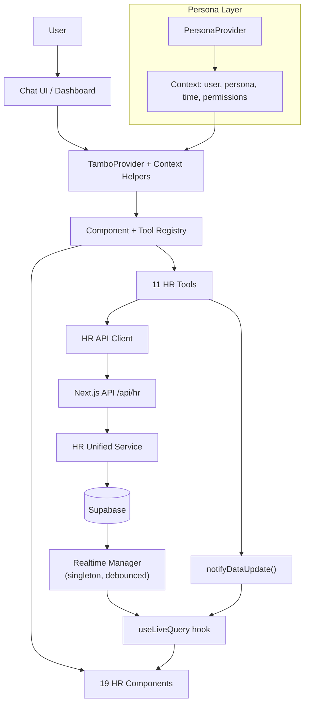

# Zoho People AI — Agentic Generative UI

An intent-driven, persona-aware HR workspace that reimagines how employees, managers, and HR admins complete routine tasks. Built with **Next.js 15**, **Tambo AI**, and **Supabase**, the system uses AI to render pre-registered UI components based on user persona, intent, and context — eliminating navigation complexity while preserving control and safety.

<p align="center">
  
  
  
  
  
  
</p>

---

## Table of Contents

- [Problem Statement](#problem-statement)
- [Solution](#solution)
- [Quick Start](#quick-start)
- [Architecture Overview](#architecture-overview)
- [Personas](#personas)
- [Key Features](#key-features)
- [Project Structure](#project-structure)
- [Data Flow](#data-flow)
- [Demo Scenarios](#demo-scenarios)
- [Documentation](#documentation)
- [Tech Stack](#tech-stack)
- [Scripts Reference](#scripts-reference)

---

## Problem Statement

Enterprise HR tools like Zoho People expose powerful features through **complex, module-driven interfaces** that force users to constantly search *where* to perform routine actions. Users must learn the software instead of completing tasks — leading to navigation overhead, repeated errors, and missed workflows (checkouts, approvals, regularizations).

## Solution

We build a **persona-aware operational layer** where the AI selects and orchestrates pre-registered components instead of generating new UI. Chat is only for intent capture and clarification. All real actions happen through structured, typed UI components.

```
User input → persona → intent → context → component selection → render → state update
```

> The AI does **not** generate components. It **selects and orchestrates** from a fixed, bounded component registry — keeping the experience safe, predictable, and auditable.

---

## Quick Start

### Prerequisites

- **Node.js** 18+ and npm
- **Supabase** project (free tier works) — [supabase.com](https://supabase.com)
- **Tambo AI** API key — [tambo.co](https://tambo.co)

### Installation

```bash
# 1. Clone the repository
git clone <repo-url>
cd chat-tambo

# 2. Install dependencies
npm install

# 3. Configure environment
cp example.env.local .env.local
```

Edit `.env.local` with your keys:

```env
NEXT_PUBLIC_TAMBO_API_KEY=your-tambo-api-key
NEXT_PUBLIC_SUPABASE_URL=https://your-project.supabase.co
NEXT_PUBLIC_SUPABASE_ANON_KEY=your-supabase-anon-key
```

### Database Setup

Run the schema and seed data in your Supabase SQL editor:

```bash
# 1. Create tables (10 tables, 18 indexes, triggers, RLS)
#    Execute: supabase/schema.sql

# 2. Insert demo data (7 employees, leave balances, attendance, policies)
#    Execute: supabase/seed.sql
```

### Start Development

```bash
npm run dev
```

Open [http://localhost:3000](http://localhost:3000)

---

## Architecture Overview



### Layered Architecture

| Layer | Purpose | Key Files |
|-------|---------|-----------|
| **UI** | Chat interface, dashboard, HR components | `src/components/layout/`, `src/components/hr/` |
| **AI Orchestration** | Intent → component/tool selection | `src/lib/tambo.ts`, `src/components/layout/TamboWrapper.tsx` |
| **Hooks** | Data fetching, actions, state | `src/hooks/useLiveQuery.ts`, `useHRActions.ts`, `usePinnedWidgets.ts` |
| **API** | HTTP surface for all HR operations | `src/app/api/hr/route.ts` |
| **Service** | Business logic, Supabase queries | `src/services/hr-unified.ts`, `src/services/supabase-hr/` |
| **Realtime** | Live data sync, ref-counted channels | `src/lib/realtime-manager.ts`, `src/lib/use-realtime-hr.ts` |

---

## Personas

The system supports three personas, each with tailored UI, permissions, and context:

| Persona | Demo User | Employee ID | Capabilities |
|---------|-----------|-------------|--------------|
| **Employee** | Priya Sharma | ZP-1001 | Check in/out, leave requests, attendance history, regularization, salary slips |
| **Manager** | Rajesh Kumar | ZP-0501 | All employee features + team overview, approval queue, approve/reject requests |
| **HR Admin** | Ananya Patel | ZP-0101 | All features + system dashboard, policy management, announcements, documents, analytics |

Switch personas from the top-right dropdown in the chat interface. Each persona switch resets the chat thread and injects updated context helpers.

---

## Key Features

### Generative UI
AI dynamically selects and renders from **19 pre-registered components** based on user intent and persona — no free-form UI generation.

### Pinnable Dashboard
Users can pin any AI-rendered component to a persistent, drag-and-drop dashboard grid. Preset templates auto-seed widgets on first visit per persona.

### Real-time Updates
Singleton Supabase channel manager shares one channel per table across all subscribers with 300ms debounced fan-out. Widget data refreshes automatically.

### Proactive Intelligence
Context-aware alerts based on user state: missed checkout reminders, pending approval notifications, working hours status.

### Analytics
Real Supabase aggregation queries for attendance trends, leave analytics, team metrics, and HR analytics — with date range filtering and fallback mock data.

---

## Project Structure

```
src/
├── app/                          # Next.js App Router
│   ├── layout.tsx                # Root layout (ClientProviders wrapper)
│   ├── page.tsx                  # Home → ChatPage
│   ├── chat/page.tsx             # Standalone chat view
│   ├── dashboard/page.tsx        # Pinned widget dashboard
│   └── api/hr/                   # Unified HR API route (GET + POST)
│
├── components/
│   ├── layout/                   # App shell & page layouts
│   │   ├── ClientProviders.tsx   # PersonaProvider + TamboWrapper
│   │   ├── AppShell.tsx          # TopBar + ChatPanel shell
│   │   ├── ChatPage.tsx          # Full chat interface
│   │   ├── ChatPanel.tsx         # Collapsible side chat
│   │   ├── PinnedDashboard.tsx   # Drag-and-drop widget grid
│   │   ├── WidgetWrapper.tsx     # Single widget renderer + data mapper
│   │   ├── TopBar.tsx            # Navigation header
│   │   └── proactive/            # Persona-specific proactive dashboards
│   │       ├── EmployeeDashboard.tsx
│   │       ├── ManagerDashboard.tsx
│   │       ├── HRDashboard.tsx
│   │       └── shared.tsx        # ProactiveAlert, useDashboardFetch
│   │
│   ├── hr/                       # Domain-specific HR components
│   │   ├── employee/             # Employee-scoped UI
│   │   │   ├── CheckInOutCard.tsx
│   │   │   ├── LeaveBalanceCard.tsx
│   │   │   ├── LeaveRequestForm.tsx
│   │   │   ├── AttendanceTimeline.tsx
│   │   │   ├── RegularizationForm.tsx
│   │   │   ├── RequestStatusList.tsx
│   │   │   └── EmployeeDirectory.tsx
│   │   ├── manager/              # Manager-scoped UI
│   │   │   ├── ApprovalQueue.tsx
│   │   │   ├── ApprovalDetail.tsx
│   │   │   └── TeamOverview.tsx
│   │   ├── admin/                # HR Admin-scoped UI
│   │   │   ├── SystemDashboard.tsx
│   │   │   ├── PolicyViewer.tsx
│   │   │   ├── PolicyManager.tsx
│   │   │   ├── AnnouncementBoard.tsx
│   │   │   └── DocumentCenter.tsx
│   │   └── shared/               # Cross-persona components
│   │       ├── AnnouncementsFeed.tsx
│   │       ├── DocumentsAcknowledgeList.tsx
│   │       ├── SalarySlipForm.tsx
│   │       ├── StatusBadge.tsx
│   │       ├── LoadingCard.tsx
│   │       └── EmptyState.tsx
│   │
│   ├── tambo/                    # Tambo AI chat primitives
│   └── ui/                       # Radix-based UI primitives
│
├── contexts/
│   └── PersonaContext.tsx        # Persona state, user profiles
│
├── hooks/
│   ├── useLiveQuery.ts           # Data fetching + realtime + refresh registry
│   ├── usePinnedWidgets.ts       # Dashboard widget CRUD + auto-seeding
│   ├── useHRActions.ts           # Direct HR action functions
│   └── useAsyncAction.ts         # Generic async state wrapper
│
├── lib/
│   ├── tambo.ts                  # Component + tool registration for AI
│   ├── component-registry.ts     # Single source of truth for components
│   ├── api-client.ts             # Shared HTTP helpers (apiGet, apiPost)
│   ├── realtime-manager.ts       # Singleton channel manager
│   ├── use-realtime-hr.ts        # HR realtime subscription hook
│   └── supabase.ts               # Supabase client initialization
│
├── services/
│   ├── hr-api-client.ts          # Client-side API wrapper (tools)
│   ├── hr-unified.ts             # Server-side unified service
│   ├── query-resolver.ts         # QueryId → service function mapping
│   └── supabase-hr/              # Supabase data access modules
│       ├── employees.ts
│       ├── attendance.ts
│       ├── leave.ts
│       ├── notifications.ts
│       ├── policies.ts
│       ├── announcements.ts
│       ├── documents.ts
│       ├── pinned-widgets.ts
│       └── analytics.ts          # Real aggregation queries
│
├── types/
│   ├── hr.ts                     # Domain types (personas, records)
│   ├── dashboard.ts              # Widget/grid types
│   └── database.ts               # Supabase table type definitions
│
supabase/
├── schema.sql                    # 10 tables, indexes, triggers, RLS
├── seed.sql                      # Demo data for 7 employees
└── migrations/
    └── add_pinned_widgets.sql
```

---

## Data Flow

### Chat → AI → Component

```
1. User types "Show my leave balance" in chat
2. ChatPage → useTambo().sendThreadMessage()
3. TamboProvider injects contextHelpers (persona, user, time, permissions)
4. Tambo AI resolves intent → selects "getLeaveBalance" tool + "LeaveBalanceCard" component
5. Tool calls hr-api-client.getLeaveBalance(employeeId)
6. HTTP GET /api/hr?action=getLeaveBalances&employeeId=...
7. hr-unified.getLeaveBalances() → supabase-hr/leave.ts → Supabase query
8. Data returns up the chain
9. Tambo renders LeaveBalanceCard inline with structured data as props
```

### Dashboard Widget Data

```
1. PinnedDashboard renders WidgetWrapper for each pinned widget
2. WidgetWrapper calls useLiveQuery(queryId, params)
3. useLiveQuery → POST /api/query → query-resolver → hr-unified → Supabase
4. PROPS_MAPPERS transform raw data → component-specific props
5. Component renders with live data
6. Realtime manager subscribes to relevant tables → auto-refresh on changes
```

### Realtime Updates

```
1. RealtimeManager singleton maintains one channel per Supabase table
2. Subscribers attach via subscribe(table, callback) — ref-counted
3. Database changes trigger 300ms debounced fan-out to all listeners
4. Listeners call refresh() → components re-fetch and re-render
5. Last subscriber unsubscribe tears down the channel
```

---

## Demo Scenarios

Switch personas from the top-right dropdown and try these prompts:

### Employee (Priya Sharma)

| Prompt | Expected Component |
|--------|--------------------|
| "What is my leave balance?" | LeaveBalanceCard with 5 leave types |
| "Mark my check-in for today" | CheckInOutCard with confirmation |
| "Apply for 2 days casual leave from Feb 15" | LeaveRequestForm pre-filled |
| "Show my pending requests" | RequestStatusList |
| "I forgot to check out yesterday at 6:30 PM" | RegularizationForm |
| "Show my attendance this week" | AttendanceTimeline |

### Manager (Rajesh Kumar)

| Prompt | Expected Component |
|--------|--------------------|
| "Show my pending approvals" | ApprovalQueue with team requests |
| "Show my team's status today" | TeamOverview with status badges |
| "Approve Priya's leave request" | ApprovalDetail with approve/reject |

### HR Admin (Ananya Patel)

| Prompt | Expected Component |
|--------|--------------------|
| "Show the HR dashboard" | SystemDashboard with 6 metric cards |
| "What is the leave policy?" | PolicyViewer with policy content |
| "Show attendance trends" | Graph with aggregated analytics |
| "Show employee directory" | EmployeeDirectory with search |

Full test checklist: [TEST_SCENARIOS.md](TEST_SCENARIOS.md)

---

## Documentation

| Document | Description |
|----------|-------------|
| [docs/ARCHITECTURE.md](docs/ARCHITECTURE.md) | Deep-dive into system architecture, patterns, and design decisions |
| [docs/API_REFERENCE.md](docs/API_REFERENCE.md) | Complete API route documentation with request/response examples |
| [docs/COMPONENTS.md](docs/COMPONENTS.md) | Component catalog with props, schemas, and persona mapping |
| [docs/SETUP.md](docs/SETUP.md) | Detailed setup, configuration, and deployment guide |
| [docs/EMPLOYEE_PERSONA.md](docs/EMPLOYEE_PERSONA.md) | Employee persona component architecture |
| [docs/MANAGER_PERSONA.md](docs/MANAGER_PERSONA.md) | Manager persona component architecture |
| [docs/HR_ADMIN_PERSONA.md](docs/HR_ADMIN_PERSONA.md) | HR Admin persona component architecture |
| [docs/QUERY_FLOW.md](docs/QUERY_FLOW.md) | End-to-end query lifecycle trace |
| [TEST_SCENARIOS.md](TEST_SCENARIOS.md) | 20 test scenarios across all personas |
| [PROJECT_DOCUMENT.md](PROJECT_DOCUMENT.md) | Project summary for submissions |

---

## Tech Stack

| Category | Technology | Version |
|----------|-----------|---------|
| Framework | Next.js (App Router) | 15.5.7 |
| UI Library | React | 19.1.1 |
| Language | TypeScript | 5.x (strict mode) |
| AI SDK | Tambo AI (`@tambo-ai/react`) | 0.70.0 |
| Database | Supabase (PostgreSQL + Realtime) | 2.95.1 |
| Styling | Tailwind CSS v4 | 4.x |
| UI Primitives | Radix UI | Multiple |
| Charts | Recharts | 3.5.0 |
| Dashboard Grid | react-grid-layout | 2.2.2 |
| Validation | Zod | via Tambo |
| Rich Text | TipTap | 3.17.1 |
| Testing | Vitest | 3.2.4 |

---

## Scripts Reference

| Command | Description |
|---------|-------------|
| `npm run dev` | Start development server on localhost:3000 |
| `npm run build` | Production build |
| `npm run start` | Start production server |
| `npm run lint` | Run ESLint |
| `npm run lint:fix` | Auto-fix lint issues |
| `npm run test` | Run tests (Vitest) |
| `npm run test:watch` | Run tests in watch mode |

---

## License

Private — not for redistribution.
