# Architecture Documentation

> Deep-dive into the system design, patterns, and technical decisions behind Zoho People AI.

---

## Table of Contents

- [Design Philosophy](#design-philosophy)
- [System Architecture](#system-architecture)
- [Provider Architecture](#provider-architecture)
- [Component Registry System](#component-registry-system)
- [Tool System](#tool-system)
- [Data Layer](#data-layer)
- [Realtime Architecture](#realtime-architecture)
- [Dashboard System](#dashboard-system)
- [Query Resolution](#query-resolution)
- [Persona System](#persona-system)
- [Key Design Patterns](#key-design-patterns)
- [Performance Optimizations](#performance-optimizations)

---

## Design Philosophy

### Bounded Generative UI

The core principle: **AI selects from pre-registered components, it does not generate new UI.** This creates a system that is:

- **Safe** — Only registered, tested components can be rendered
- **Predictable** — Same intent always maps to the same component type
- **Auditable** — Every rendered component has a known schema and behavior

### Mental Model Shift

```
Traditional:  User → Menu → Submenu → Screen → Action
This System:  User → Persona → Intent → Component → Action
```

### Separation of Concerns

| Concern | Owner | Pattern |
|---------|-------|---------|
| Intent understanding | Tambo AI | Natural language → structured intent |
| Component selection | Tambo AI + Registry | Intent → registered component lookup |
| Data fetching | Tools + API Route | Structured schemas → HTTP → Supabase |
| State management | Hooks + Realtime | Subscription-based reactivity |
| Rendering | React Components | Props-driven, persona-aware UI |

---

## System Architecture

### High-Level Diagram

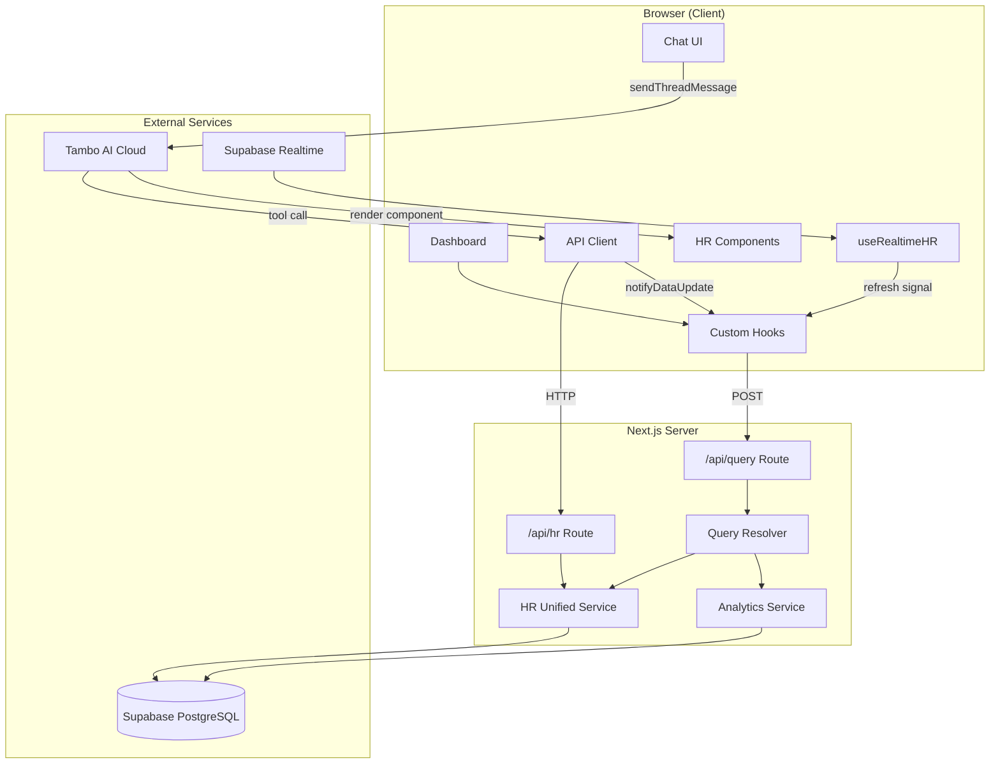

### Request Flow Layers

```
┌──────────────────────────────────────────────────────────────┐
│  UI Layer                                                     │
│  ChatPage / PinnedDashboard / ProactiveDashboard             │
├──────────────────────────────────────────────────────────────┤
│  AI Orchestration Layer                                       │
│  TamboProvider + contextHelpers + component/tool registry    │
├──────────────────────────────────────────────────────────────┤
│  Hook Layer                                                   │
│  useLiveQuery / useHRActions / usePinnedWidgets              │
├──────────────────────────────────────────────────────────────┤
│  API Client Layer                                             │
│  apiGet() / apiPost() → /api/hr, /api/query                 │
├──────────────────────────────────────────────────────────────┤
│  API Route Layer                                              │
│  Next.js route handlers (Node.js runtime)                    │
├──────────────────────────────────────────────────────────────┤
│  Service Layer                                                │
│  hr-unified.ts → supabase-hr/* modules                       │
├──────────────────────────────────────────────────────────────┤
│  Data Layer                                                   │
│  Supabase PostgreSQL + Realtime subscriptions                │
└──────────────────────────────────────────────────────────────┘
```

### End-to-End Sequence Diagrams

The following sequence diagrams trace every interaction from application startup to the three core user workflows: **chat-driven actions**, **dashboard rendering**, and **realtime sync**.

---

#### 1. Application Bootstrap

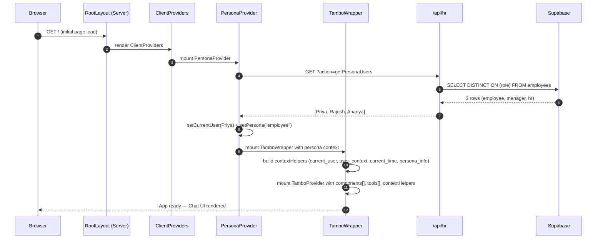

---

#### 2. Chat Workflow — Intent to Rendered Component

This traces the complete flow when a user types a natural language query (e.g., *"Show my leave balance"*) and receives an AI-rendered component.

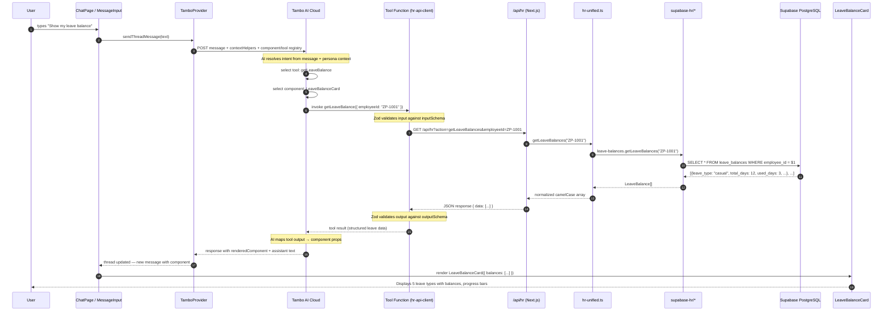

---

#### 3. Chat Workflow — Mutation with Side Effects

This traces a write operation (e.g., *"Mark my check-in"*) including data mutation, UI update, realtime broadcast, and dashboard refresh.

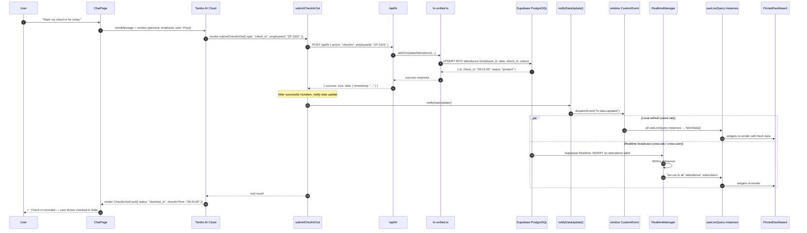

---

#### 4. Dashboard Workflow — Widget Rendering

This traces how the pinned dashboard loads, fetches data, and renders widgets independently of the chat flow.

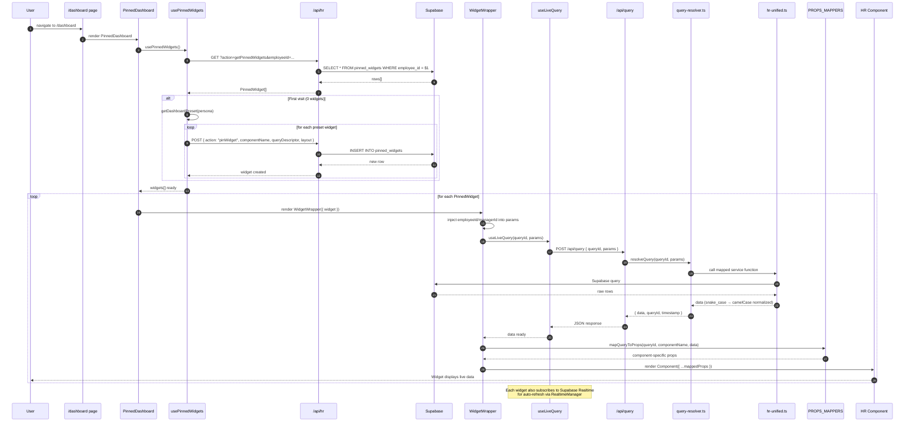

---

#### 5. Pinning a Widget — Chat to Dashboard

This traces pinning an AI-rendered component from the chat thread onto the persistent dashboard.

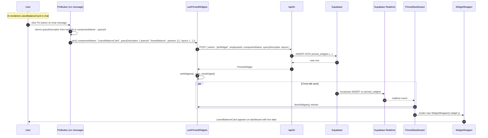

---

#### 6. Realtime Sync — Database Change Propagation

This traces how a database change (e.g., a manager approves a leave request from another tab) propagates to all connected clients.

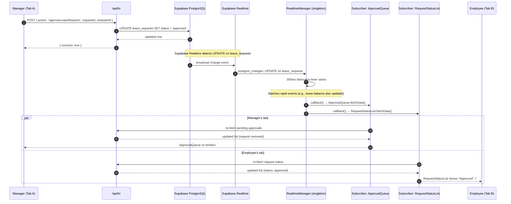

---

#### 7. Persona Switch Flow

This traces what happens when a user switches personas (e.g., Employee → Manager).

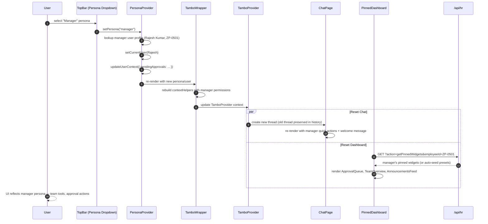

---

#### 8. Complete End-to-End — First Visit to Action

This unified diagram shows the full journey from a brand-new user's first page load through their first meaningful interaction.

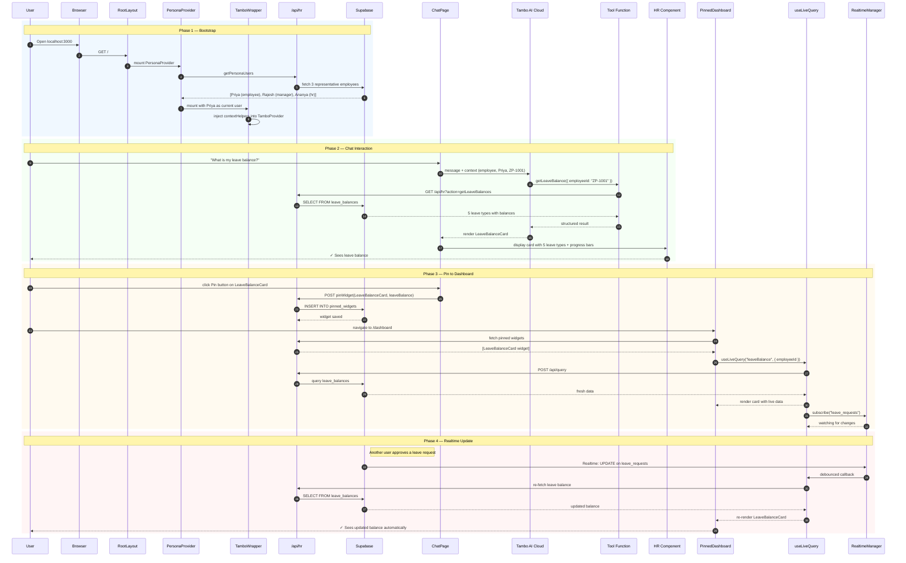

---

## Provider Architecture

Providers are composed once at the root layout level and persist across all page navigations:

```
RootLayout (Server Component)
  └── ClientProviders ("use client")
        └── PersonaProvider          ← persona state, user profiles
              └── TamboWrapper       ← TamboProvider with contextHelpers
                    └── {children}   ← all pages
```

### Why Root-Level Providers?

Previously, each page re-wrapped providers, causing:
- Thread state loss on navigation
- Re-initialization of Supabase connections
- Persona context resets

The current architecture mounts providers **once** in `layout.tsx`, so chat threads, persona selection, and Supabase connections persist when switching between Home, Dashboard, and Chat pages.

### Context Helpers

`TamboWrapper` injects four context helpers into every Tambo AI interaction:

| Helper | Data Provided | Purpose |
|--------|---------------|---------|
| `current_user` | employeeId, name, email, role, department, managerId | User identity for tool calls |
| `user_context` | isCheckedIn, hasMissedCheckout, pendingApprovals, notifications | State-aware recommendations |
| `current_time` | date, time, dayOfWeek, timestamp | Time-sensitive actions |
| `persona_info` | currentPersona, canViewTeam, canApprove, canManagePolicies | Permission boundaries |

---

## Component Registry System

### Dual Registry Design

The system uses two complementary registries:

**1. Component Registry** (`src/lib/component-registry.ts`)
- Single source of truth for component references and dashboard metadata
- Maps component names to React components, grid layouts, labels, and persona access
- Used by both the dashboard system and AI rendering

**2. Tambo Registry** (`src/lib/tambo.ts`)
- Adds AI-specific metadata on top of the component registry
- Provides descriptions for AI intent matching and Zod `propsSchema` for validated rendering
- References components via `comp("ComponentName")` helper that looks up the component registry

```typescript
// component-registry.ts — the source of truth
export const componentRegistry = {
  CheckInOutCard: {
    component: CheckInOutCard,          // React component
    defaultLayout: { x: 0, y: 0, w: 4, h: 3 },  // Grid position
    label: "Check In / Out",             // Display name
    persona: ["employee"],               // Who can see it
  },
  // ... 18 more components
};

// tambo.ts — AI layer on top
export const components: TamboComponent[] = [
  {
    name: "CheckInOutCard",
    description: "...",                  // AI intent matching
    component: comp("CheckInOutCard"),   // Resolved from registry
    propsSchema: z.object({ ... }),      // Validated props
  },
];
```

### Registered Components (19 total)

| Component | Persona | Description |
|-----------|---------|-------------|
| `Graph` | All | Recharts data visualization |
| `CheckInOutCard` | Employee | Today's attendance + check-in/out actions |
| `LeaveBalanceCard` | Employee | Leave type balances with progress bars |
| `LeaveRequestForm` | Employee | Leave application form |
| `SalarySlipForm` | Employee | Salary slip download form |
| `RequestStatusList` | Employee | Pending/past request tracker |
| `AttendanceTimeline` | Employee | Weekly attendance history |
| `RegularizationForm` | Employee | Missed checkout/check-in correction |
| `EmployeeDirectory` | Manager, HR | Searchable employee directory |
| `ApprovalQueue` | Manager, HR | Pending approval requests |
| `ApprovalDetail` | Manager, HR | Single approval with approve/reject |
| `TeamOverview` | Manager | Team member status grid |
| `SystemDashboard` | HR | Organization-wide metric cards |
| `PolicyViewer` | All | Policy search and display |
| `PolicyManager` | HR | Policy CRUD management |
| `AnnouncementsFeed` | All | Announcement list (read-only) |
| `AnnouncementBoard` | HR | Announcement management |
| `DocumentCenter` | HR | Document upload and management |
| `DocumentsAcknowledgeList` | All | Document list with acknowledgment |

---

## Tool System

Tools are structured functions that the AI can invoke to fetch data or perform actions. Each tool has:
- **Zod input schema** — validates parameters before execution
- **Zod output schema** — defines the expected response shape
- **Implementation** — calls `hr-api-client.ts` functions

### Registered Tools (11 total)

| Tool | Category | Action |
|------|----------|--------|
| `getAttendanceStatus` | Attendance | Fetch check-in status + weekly records |
| `submitCheckInOut` | Attendance | Clock in or clock out |
| `submitRegularization` | Attendance | Fix missed check-in/checkout |
| `getLeaveBalance` | Leave | Fetch all leave type balances |
| `submitLeaveRequest` | Leave | Apply for leave |
| `getPendingApprovals` | Approvals | Fetch pending requests for manager |
| `processApproval` | Approvals | Approve or reject a request |
| `searchPolicies` | Policies | Search HR policies by keyword |
| `getAttendanceTrends` | Analytics | Attendance data over time periods |
| `getLeaveAnalytics` | Analytics | Leave usage analytics |
| `getTeamMetrics` | Analytics | Team performance metrics |
| `getHRAnalytics` | Analytics | Organization-wide HR analytics |

### Tool Execution Flow

```
1. Tambo AI decides to call a tool based on user intent
2. Input is validated against the tool's Zod inputSchema
3. Tool function is called (hr-api-client.ts)
4. Client makes HTTP request to /api/hr
5. API route delegates to hr-unified.ts
6. hr-unified calls the appropriate supabase-hr module
7. Response flows back and is validated against outputSchema
8. AI uses the output to render the selected component
```

---

## Data Layer

### API Route Architecture

All HR operations go through a single API route (`/api/hr`) with action-based dispatch:

```
GET  /api/hr?action=getLeaveBalances&employeeId=...
POST /api/hr  { action: "createLeaveRequest", ... }
```

**GET actions** (21): Read operations for employees, attendance, leave, approvals, notifications, policies, announcements, documents, system metrics, pinned widgets.

**POST actions** (24): Write operations for attendance, leave requests, approvals, regularization, notifications, documents, announcements, policies, pinned widgets.

### Service Layer

```
/api/hr route
  └── hr-unified.ts          ← Unified entry point
        └── supabase-hr/     ← Data access modules
              ├── employees.ts
              ├── attendance.ts
              ├── leave.ts
              ├── notifications.ts
              ├── policies.ts
              ├── announcements.ts
              ├── documents.ts
              ├── pinned-widgets.ts
              └── analytics.ts    ← Aggregation queries
```

`hr-unified.ts` always requires Supabase to be configured. Each function delegates to the corresponding `supabase-hr/*` module.

### Query System

The dashboard uses a separate query endpoint (`/api/query`) with a `queryId` system:

```typescript
// Client sends:
POST /api/query { queryId: "leaveBalance", params: { employeeId: "..." } }

// query-resolver.ts maps queryId → service function:
const QUERY_MAP = {
  leaveBalance: (p) => unified.getLeaveBalances(p.employeeId),
  attendanceStatus: (p) => unified.getTodayAttendance(p.employeeId),
  pendingApprovals: (p) => unified.getAllPendingApprovals(p.managerId),
  // ... 13 more query IDs
};
```

---

## Realtime Architecture

### Singleton Channel Manager

```
src/lib/realtime-manager.ts
```

The realtime manager ensures **exactly one Supabase channel per table**, shared across all subscribers via ref-counting:

```
┌─────────────────────────────────┐
│     Realtime Manager            │
│     (Singleton)                 │
│                                 │
│  channels Map:                  │
│  ┌──────────────────────────┐  │
│  │ "leave_requests"         │  │
│  │  channel: RealtimeChannel│  │
│  │  listeners: Set (3)      │  │
│  │  debounceTimer: 300ms    │  │
│  ├──────────────────────────┤  │
│  │ "attendance"             │  │
│  │  channel: RealtimeChannel│  │
│  │  listeners: Set (5)      │  │
│  │  debounceTimer: 300ms    │  │
│  ├──────────────────────────┤  │
│  │ "notifications"          │  │
│  │  channel: RealtimeChannel│  │
│  │  listeners: Set (2)      │  │
│  │  debounceTimer: 300ms    │  │
│  └──────────────────────────┘  │
└─────────────────────────────────┘
```

**Key behaviors:**
- **First subscriber** → creates the Supabase channel
- **Subsequent subscribers** → added to the existing `listeners` Set
- **On database change** → 300ms debounce, then fan out to all listeners
- **Last subscriber unsubscribes** → channel is torn down
- **7 supported tables**: `leave_requests`, `regularization_requests`, `notifications`, `attendance`, `announcements`, `documents`, `document_acknowledgments`

### Dual Refresh Mechanism

Components receive refresh signals from two sources:

1. **Supabase Realtime** — Database changes (cross-tab, cross-user)
2. **`hr-data-updated` CustomEvent** — Local mutations (same tab, immediate feedback)

```
Database Change ──→ Supabase Realtime ──→ RealtimeManager ──→ debounce ──→ listeners
                                                                             │
User Action ──→ Tool/API call ──→ notifyDataUpdate() ──→ CustomEvent ──→ listeners
```

### Global Widget Refresh

`useLiveQuery` maintains a global `refreshRegistry` Set. Each mounted widget instance registers its `fetchData` function. The exported `refreshAllWidgets()` uses `Promise.allSettled()` to refresh all widgets concurrently.

---

## Dashboard System

### Pinned Widget Architecture

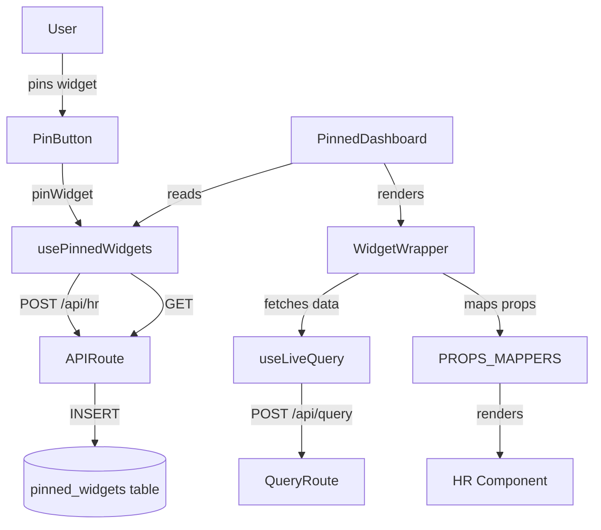

### Widget Lifecycle

1. **Pinning**: User clicks the pin button on an AI-rendered component → `usePinnedWidgets.pin()` saves to `pinned_widgets` table with component name, query descriptor, layout, and title
2. **Loading**: `PinnedDashboard` fetches all pinned widgets → renders each in a `WidgetWrapper`
3. **Data Fetching**: `WidgetWrapper` calls `useLiveQuery(queryId, params)` → resolves data from the query route
4. **Props Mapping**: `PROPS_MAPPERS` transform raw query results into component-specific props
5. **Rendering**: The HR component renders with mapped props
6. **Layout**: `react-grid-layout` handles drag-and-drop repositioning (debounced 800ms saves)
7. **Realtime**: `useLiveQuery` subscribes to relevant Supabase tables → auto-refreshes on changes

### Dashboard Presets

First-time visitors get auto-seeded dashboards per persona:

| Persona | Default Widgets |
|---------|-----------------|
| Employee | CheckInOutCard, LeaveBalanceCard, RequestStatusList, AnnouncementsFeed |
| Manager | ApprovalQueue, TeamOverview, AnnouncementsFeed |
| HR | SystemDashboard, ApprovalQueue, Graph (Department Distribution) |

---

## Query Resolution

### Query ID Mapping

The `query-resolver.ts` maintains three mapping tables:

**1. queryId → Service Function**

| Query ID | Service Call |
|----------|-------------|
| `attendanceStatus` | `unified.getTodayAttendance(employeeId)` |
| `leaveBalance` | `unified.getLeaveBalances(employeeId)` |
| `requestStatus` | `unified.getLeaveRequests(employeeId)` |
| `pendingApprovals` | `unified.getAllPendingApprovals(managerId)` |
| `teamMembers` | `unified.getTeamMembers(managerId)` |
| `systemMetrics` | `unified.getSystemMetrics()` |
| `policies` | `unified.searchPolicies(query)` / `getPolicies()` |
| `announcements` | `unified.getAnnouncements()` |
| `documents` | `unified.getDocuments()` |
| `allEmployees` | `unified.getAllEmployees()` |
| `attendanceTrends` | `analytics.getAttendanceTrends(period, startDate, endDate)` |
| `leaveAnalytics` | `analytics.getLeaveAnalytics(type, startDate, endDate)` |
| `teamMetrics` | `analytics.getTeamMetrics(metric, managerId)` |
| `hrAnalytics` | `analytics.getHRAnalytics(metric)` |

**2. toolName → queryId** (for cache invalidation)

**3. componentName → queryId** (for default data requirements)

### Realtime Table Mapping

Each `queryId` maps to Supabase tables for realtime subscriptions:

```typescript
const QUERY_TABLE_MAP = {
  attendanceStatus: ["attendance"],
  leaveBalance: ["leave_requests"],
  requestStatus: ["leave_requests", "regularization_requests"],
  pendingApprovals: ["leave_requests", "regularization_requests"],
  // ...
};
```

---

## Persona System

### PersonaContext

`PersonaContext` provides:

| Property | Type | Description |
|----------|------|-------------|
| `currentPersona` | `"employee" \| "manager" \| "hr"` | Active persona role |
| `setPersona(role)` | Function | Switch persona |
| `currentUser` | `UserProfile` | Active user profile from Supabase |
| `userContext` | `UserContext` | Live state (checked in, pending approvals) |
| `updateUserContext(partial)` | Function | Update user context |
| `availablePersonas` | `PersonaRole[]` | Roles with employee data |

### User Loading

On mount, `PersonaContext` calls `apiGet("getPersonaUsers")` which fetches **one representative employee per role** (3 rows) instead of all employees — optimized for quick persona switching.

### Persona-Aware Rendering

1. **ChatPage** shows persona-specific quick actions and welcome messages
2. **ProactiveDashboard** renders persona-specific alert panels
3. **Component Registry** filters available components by persona
4. **Dashboard Presets** auto-seed different widgets per persona
5. **TamboWrapper** sends persona permissions to AI context

---

## Key Design Patterns

### 1. Single Source of Truth (Component Registry)

All component metadata lives in `component-registry.ts`. Both the AI system and dashboard reference this registry, preventing drift.

### 2. Ref-Counted Singletons (Realtime Manager)

The realtime manager uses a `Map<table, { channel, listeners }>` pattern — creating channels on first subscribe and tearing down on last unsubscribe.

### 3. Action-Based API Dispatch

Instead of REST-style routes, a single `/api/hr` endpoint dispatches by `action` parameter:

```
GET  ?action=getLeaveBalances&employeeId=...
POST { action: "createLeaveRequest", ... }
```

This keeps the routing simple and the API surface consolidated.

### 4. Props Mapping Layer

`WidgetWrapper` uses `PROPS_MAPPERS` — a registry of functions that transform raw query data into component-specific props — decoupling data shape from component expectations.

### 5. Stable Serialization

`stableStringify()` sorts object keys before JSON serialization, preventing unnecessary re-renders from key-order differences in query parameters.

### 6. Dual Event Bus

Components refresh from both Supabase Realtime (cross-user sync) and local `CustomEvent` dispatch (immediate feedback), ensuring responsive UX regardless of event source.

---

## Performance Optimizations

| Optimization | Description | Impact |
|-------------|-------------|--------|
| **Root-level providers** | Providers mounted once in `layout.tsx` | No re-initialization on navigation |
| **Singleton channels** | One Supabase channel per table | Reduced connection overhead |
| **300ms debounce** | Batch rapid realtime events | Fewer re-renders during bulk operations |
| **Stable param serialization** | `stableStringify` prevents spurious fetches | Avoids infinite re-render loops |
| **Optimized persona fetch** | 3 rows via `getPersonaUsers()` | Fast initial load |
| **Debounced layout saves** | 800ms debounce on grid drag | Fewer API calls during repositioning |
| **Promise.allSettled refresh** | Concurrent widget refresh | All widgets update in parallel |
| **Shared HTTP client** | Single `apiGet`/`apiPost` module | Consistent error handling, DRY |

---

## Database Schema

10 PostgreSQL tables with Supabase Realtime enabled on 7:

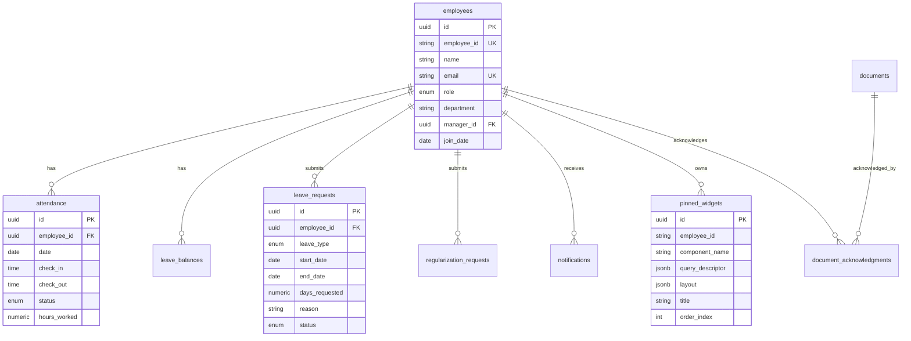

Full schema: [supabase/schema.sql](../supabase/schema.sql)
