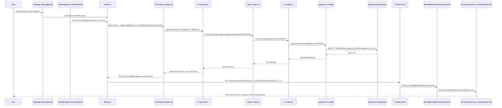

# Query Flow: Database to Rendered Component

This document traces the complete lifecycle of a user query—from the moment a user types a message in the chat, through intent resolution, tool execution, database access, and finally to the rendered component appearing in the UI with fresh data.

---

## High-Level Flow

```
User types message
  → ChatPage sends via useTambo()
    → TamboProvider (with contextHelpers)
      → Tambo AI resolves intent
        → Selects Tool(s) + Component
          → Tool calls hr-api-client function
            → HTTP request to /api/hr (Next.js API route)
              → hr-unified service
                → supabase-hr module
                  → Supabase DB query
                ← Raw rows returned
              ← Normalized data
            ← JSON response
          ← Tool output (structured data)
        → Tambo renders selected Component with tool output as props
      ← message.renderedComponent set
    ← Thread updated with new message
  ← MessageRenderedComponentArea renders the component inline
```

---

## Concrete Example: "Show my leave balance"

We'll trace every function call, file, and line of logic for this specific query.

---

### Step 1 — User Sends Message

**File:** `src/components/layout/ChatPage.tsx`

The user types `"Show my leave balance"` and the `<MessageInput>` component captures it. On submit, Tambo's internal hook (`useTambo()`) sends the message to the Tambo AI backend along with the thread context.

```
ChatPage → <MessageInput> → useTambo().sendMessage("Show my leave balance")
```

---

### Step 2 — Context Injection via TamboWrapper

**File:** `src/components/layout/TamboWrapper.tsx`

Before Tambo processes the message, the `<TamboProvider>` injects `contextHelpers` into every prompt. These helpers are defined in `TamboWrapper` and include:

| Helper           | Returns                                                                 |
|------------------|-------------------------------------------------------------------------|
| `current_user`   | `employeeId`, `name`, `email`, `role`, `department`, `managerId`        |
| `user_context`   | `isCheckedInToday`, `hasMissedCheckout`, `pendingApprovals`, etc.       |
| `current_time`   | `date`, `time`, `dayOfWeek`, `timestamp`                                |
| `persona_info`   | `currentPersona`, `canViewTeam`, `canApprove`, `canManagePolicies`      |

These are generated from `usePersona()` (which loads user profiles from the database on mount via `getAllEmployees()`).

Tambo sees the full context alongside the user message:
```
{
  message: "Show my leave balance",
  context: {
    current_user: { employeeId: "EMP001", name: "Ravi Kumar", role: "employee", ... },
    persona_info: { currentPersona: "employee", canApprove: false, ... },
    current_time: { date: "2026-02-11", ... }
  }
}
```

---

### Step 3 — Tambo AI Resolves Intent → Selects Tool + Component

**File:** `src/lib/tambo.ts`

Tambo's AI backend matches the message to registered tools and components. The registrations are defined in `tambo.ts`:

**Tool selected:** `getLeaveBalance`
```ts
{
  name: "getLeaveBalance",
  description: "Get the leave balance for an employee...",
  tool: getLeaveBalance,                       // ← function from hr-api-client.ts
  inputSchema: z.object({
    employeeId: z.string(),
  }),
  outputSchema: z.array(z.object({ ... })),
}
```

**Component selected:** `LeaveBalanceCard`
```ts
{
  name: "LeaveBalanceCard",
  description: "A card showing all leave balances...",
  component: LeaveBalanceCard,                  // ← React component
  propsSchema: z.object({
    balances: z.array(z.object({ ... })),
  }),
}
```

Tambo extracts the `employeeId` from the injected `current_user` context and calls the tool.

---

### Step 4 — Tool Executes: `getLeaveBalance()` in hr-api-client

**File:** `src/services/hr-api-client.ts` — `getLeaveBalance()`

This is a **client-side** function. It makes an HTTP GET request to the Next.js API route:

```ts
export async function getLeaveBalance(params: { employeeId: string }) {
  const balances = await get<...>("getLeaveBalances", { employeeId: params.employeeId });
  // Maps snake_case from DB → camelCase for the UI
  return balances.map((balance) => ({
    leaveType: balance.leave_type,
    totalDays: balance.total_days,
    usedDays: balance.used_days,
    remainingDays: balance.remaining_days,
    label: labels[balance.leave_type] || balance.leave_type,
  }));
}
```

The `get()` helper constructs: `GET /api/hr?action=getLeaveBalances&employeeId=EMP001`

---

### Step 5 — API Route Handles the Request

**File:** `src/app/api/hr/route.ts` — `GET()`

The Next.js API route receives the request and dispatches by `action`:

```ts
case "getLeaveBalances":
  if (!employeeId) {
    return NextResponse.json({ error: "employeeId required" }, { status: 400 });
  }
  const leaveBalances = await hrService.getLeaveBalances(employeeId);
  return NextResponse.json(leaveBalances || []);
```

It delegates to `hrService` which is imported from `hr-unified.ts`.

---

### Step 6 — Unified Service: `hr-unified.ts`

**File:** `src/services/hr-unified.ts` — `getLeaveBalances()`

This is a thin routing layer. It checks that Supabase is configured, then forwards to the Supabase module:

```ts
export async function getLeaveBalances(employeeId: string) {
  requireSupabase();  // throws if SUPABASE_URL / ANON_KEY not set
  return supabaseHR.getLeaveBalances(employeeId);
}
```

---

### Step 7 — Supabase Module: `supabase-hr/leave-balances.ts`

**File:** `src/services/supabase-hr/leave-balances.ts`

This is where the actual database query runs. It uses the Supabase JS client:

```ts
export async function getLeaveBalances(employeeId: string) {
  const employeeUuid = await resolveEmployeeUuid(employeeId);
  const { data, error } = await getDb()
    .from('leave_balances')
    .select('*')
    .eq('employee_id', employeeUuid);
  return data || [];
}
```

Key helpers used:
- `getDb()` — returns the Supabase client instance (from `src/lib/supabase.ts`)
- `resolveEmployeeUuid()` — maps a human-readable `employee_id` (e.g., `"EMP001"`) to the Supabase UUID primary key

**Database table queried:** `leave_balances`

---

### Step 8 — Data Flows Back Up the Stack

The response travels back through each layer:

```
supabase-hr/leave-balances.ts  →  returns raw rows
       ↓
hr-unified.ts                  →  passes through
       ↓
route.ts (API)                 →  NextResponse.json(leaveBalances)
       ↓
hr-api-client.ts               →  maps snake_case → camelCase, adds labels
       ↓
Tambo tool output              →  structured array validated against outputSchema
```

The final tool output looks like:
```json
[
  { "leaveType": "casual",  "totalDays": 12, "usedDays": 3, "remainingDays": 9,  "label": "Casual Leave" },
  { "leaveType": "sick",    "totalDays": 6,  "usedDays": 1, "remainingDays": 5,  "label": "Sick Leave" },
  { "leaveType": "earned",  "totalDays": 15, "usedDays": 5, "remainingDays": 10, "label": "Earned Leave" },
  { "leaveType": "wfh",     "totalDays": 24, "usedDays": 8, "remainingDays": 16, "label": "Work From Home" },
  { "leaveType": "comp_off","totalDays": 3,  "usedDays": 0, "remainingDays": 3,  "label": "Compensatory Off" }
]
```

---

### Step 9 — Tambo Renders the Component

Tambo AI takes the tool output and maps it to the selected component's `propsSchema`. It creates a `renderedComponent` on the assistant message:

```
message.renderedComponent = <LeaveBalanceCard balances={toolOutput} />
```

This is stored on the `TamboThreadMessage` object inside the thread.

---

### Step 10 — Thread Renders the Component in the Chat

**File:** `src/components/tambo/thread-content.tsx` — `ThreadContentMessages`

The `ThreadContentMessages` component iterates through `thread.messages` and renders each one using the `<Message>` component:

```tsx
{filteredMessages.map((message) => (
  <Message role={message.role} message={message}>
    <MessageContent />
    <ToolcallInfo />
    <MessageRenderedComponentArea />    ← THIS renders the component
  </Message>
))}
```

**File:** `src/components/tambo/message.tsx` — `MessageRenderedComponentArea`

This component checks `message.renderedComponent` and renders it inline:

```tsx
if (!message.renderedComponent || role !== "assistant") return null;
return <div className="w-full pt-2 px-2">{message.renderedComponent}</div>;
```

---

### Step 11 — The LeaveBalanceCard Component Renders

**File:** `src/components/hr/employee/LeaveBalanceCard.tsx`

The component receives `balances` as props and renders a card with progress bars:

```tsx
export function LeaveBalanceCard({ balances }: { balances: LeaveBalance[] }) {
  return (
    <Card>
      <CardHeader>Leave Balance</CardHeader>
      <CardContent>
        {balances.map((balance) => (
          <div key={balance.leaveType}>
            <span>{balance.label}</span>
            <Progress value={(balance.remainingDays / balance.totalDays) * 100} />
            <span>Used: {balance.usedDays} | Remaining: {balance.remainingDays}</span>
          </div>
        ))}
      </CardContent>
    </Card>
  );
}
```

The user sees a styled card with all their leave balances rendered inside the chat thread.

---

## Write Flow Example: "Apply for 2 days casual leave next week"

For **write operations**, the flow includes data mutation and UI refresh.

### Steps 1–3: Same as Read Flow

User message → context injection → Tambo selects tool `submitLeaveRequest` + component `LeaveRequestForm`.

### Step 4 — Tool: `submitLeaveRequest()` in hr-api-client

**File:** `src/services/hr-api-client.ts`

```ts
export async function submitLeaveRequest(params) {
  const result = await post<{ id: string }>("createLeaveRequest", {
    request: { employeeId, leaveType, startDate, endDate, daysRequested, reason }
  });
  notifyDataUpdate();   // ← dispatches "hr-data-updated" event
  return { success: true, requestId: result.id, message: "...", daysRequested };
}
```

This posts to the API route with action `createLeaveRequest`.

### Step 5 — API Route → hr-unified → supabase-hr/leave-requests.ts

**File:** `src/services/supabase-hr/leave-requests.ts` — `createLeaveRequest()`

```ts
export async function createLeaveRequest(request) {
  const { data, error } = await getDb()
    .from('leave_requests')
    .insert({
      employee_id: employeeUuid,
      leave_type: request.leaveType,
      start_date: request.startDate,
      end_date: request.endDate,
      days_requested: request.daysRequested,
      reason: request.reason,
      status: 'pending',
    })
    .select()
    .single();

  // Also creates a notification for the manager
  if (employee?.manager_id && newRequest) {
    await createNotification({ employeeId: employee.manager_id, type: 'new_leave_request', ... });
  }

  return data;
}
```

**Database tables written:** `leave_requests`, `notifications`

### Step 6 — UI Refresh via `notifyDataUpdate()`

After the write, `notifyDataUpdate()` fires a browser `CustomEvent`:

```ts
// src/services/hr-api-client.ts
window.dispatchEvent(new CustomEvent("hr-data-updated"));
```

Components that listen for this event refresh themselves:

| Component             | File                                       | What it refreshes           |
|-----------------------|--------------------------------------------|-----------------------------|
| `NotifierBell`        | `src/components/layout/NotifierBell.tsx`    | Notification count          |
| `ProactiveDashboard`  | `src/components/layout/ProactiveDashboard.tsx` | Dashboard widgets        |
| `ChatPage`            | `src/components/layout/ChatPage.tsx`        | Triggers contextual refresh |

### Step 7 — Supabase Real-time Also Pushes Updates

**File:** `src/lib/use-realtime-hr.ts`

Independently, the `useRealtimeHR` hook subscribes to Supabase Postgres changes:

```ts
supabase
  .channel('leave-requests-changes')
  .on('postgres_changes', { event: '*', schema: 'public', table: 'leave_requests' },
    (payload) => {
      notifyDataUpdate();   // same global event
      onLeaveRequestChange?.();
    }
  )
  .subscribe();
```

This means even if another user (e.g., the manager) approves a request from a different browser, the employee's UI will auto-refresh.

---

## Complete Function Call Chain (Summary Table)

### Read Path: `"Show my leave balance"`

| Step | Layer              | File                                          | Function                        | Purpose                              |
|------|--------------------|-----------------------------------------------|---------------------------------|--------------------------------------|
| 1    | UI                 | `src/components/layout/ChatPage.tsx`           | `useTambo().sendMessage()`      | User sends message                   |
| 2    | Context            | `src/components/layout/TamboWrapper.tsx`       | `contextHelpers` (memo)         | Injects persona, user, time          |
| 3    | AI                 | `src/lib/tambo.ts`                             | Tool + Component registry       | Tambo resolves intent → tool + UI    |
| 4    | Client             | `src/services/hr-api-client.ts`                | `getLeaveBalance()`             | HTTP GET to API route                |
| 5    | API                | `src/app/api/hr/route.ts`                      | `GET() → case "getLeaveBalances"` | Dispatches to unified service       |
| 6    | Service            | `src/services/hr-unified.ts`                   | `getLeaveBalances()`            | Validates Supabase → delegates       |
| 7    | Data Access        | `src/services/supabase-hr/leave-balances.ts`   | `getLeaveBalances()`            | `select * from leave_balances`       |
| 8    | Database           | Supabase (PostgreSQL)                          | `leave_balances` table          | Returns rows                         |
| 9    | Response           | (reverse of 7→4)                               | Data normalized at each layer    | snake_case → camelCase + labels     |
| 10   | Rendering          | `src/components/tambo/thread-content.tsx`      | `<MessageRenderedComponentArea>`| Renders `message.renderedComponent`  |
| 11   | Component          | `src/components/hr/employee/LeaveBalanceCard.tsx` | `LeaveBalanceCard`           | Displays leave data with progress bars |

### Write Path: `"Apply for 2 days casual leave"`

| Step | Layer              | File                                          | Function                         | Purpose                              |
|------|--------------------|-----------------------------------------------|----------------------------------|--------------------------------------|
| 1–3  | (same as read)     |                                               |                                  |                                      |
| 4    | Client             | `src/services/hr-api-client.ts`                | `submitLeaveRequest()`           | HTTP POST to API route               |
| 5    | API                | `src/app/api/hr/route.ts`                      | `POST() → case "createLeaveRequest"` | Dispatches to unified service     |
| 6    | Service            | `src/services/hr-unified.ts`                   | `createLeaveRequest()`           | Validates → delegates                |
| 7    | Data Access        | `src/services/supabase-hr/leave-requests.ts`   | `createLeaveRequest()`           | `INSERT INTO leave_requests`         |
| 7b   | Data Access        | `src/services/supabase-hr/notifications.ts`    | `createNotification()`           | `INSERT INTO notifications`          |
| 8    | Refresh            | `src/services/hr-api-client.ts`                | `notifyDataUpdate()`             | Fires `hr-data-updated` event        |
| 9    | Real-time          | `src/lib/use-realtime-hr.ts`                   | Supabase channel listener        | Also fires `notifyDataUpdate()`      |
| 10   | UI Listeners       | `NotifierBell`, `ProactiveDashboard`           | `window.addEventListener(...)`   | Re-fetch and re-render               |

---

## Architecture Diagram



---

## Key Files Quick Reference

| File | Role |
|------|------|
| `src/app/page.tsx` | App entry — wires `PersonaProvider` → `TamboWrapper` → `ChatPage` |
| `src/components/layout/TamboWrapper.tsx` | Injects persona/user/time context into Tambo |
| `src/components/layout/ChatPage.tsx` | Chat UI, message input, thread rendering |
| `src/lib/tambo.ts` | Registers all tools (data ops) and components (UI) with Zod schemas |
| `src/services/hr-api-client.ts` | Client-side functions; HTTP calls to `/api/hr`; `notifyDataUpdate()` |
| `src/app/api/hr/route.ts` | Next.js API route; dispatches GET/POST by `action` param |
| `src/services/hr-unified.ts` | Thin routing layer; checks Supabase config → delegates |
| `src/services/supabase-hr/*.ts` | Actual Supabase queries (one file per domain) |
| `src/lib/supabase.ts` | Supabase client initialization |
| `src/components/tambo/thread-content.tsx` | Iterates messages; renders `MessageRenderedComponentArea` |
| `src/components/tambo/message.tsx` | `MessageRenderedComponentArea` — renders `message.renderedComponent` |
| `src/components/hr/**` | All HR UI components (employee, manager, admin) |
| `src/lib/use-realtime-hr.ts` | Supabase real-time subscriptions; fires `notifyDataUpdate()` |
| `src/contexts/PersonaContext.tsx` | Loads user profiles on mount; provides persona switching |

---

## Data Refresh Mechanisms

### 1. Event-based (`hr-data-updated`)

After every write operation, `hr-api-client.ts` calls:
```ts
window.dispatchEvent(new CustomEvent("hr-data-updated"));
```

Components subscribe with:
```ts
useEffect(() => {
  window.addEventListener("hr-data-updated", handleRefresh);
  return () => window.removeEventListener("hr-data-updated", handleRefresh);
}, []);
```

### 2. Supabase Real-time

`useRealtimeHR()` subscribes to Postgres changes on tables: `leave_requests`, `regularization_requests`, `notifications`, `attendance`, `announcements`, `documents`, `document_acknowledgments`. On any change, it also fires `notifyDataUpdate()`.

### 3. Component-level Re-fetch

Some components (like `NotifierBell`, `ProactiveDashboard`) have their own `useEffect` that periodically re-fetches or listens for the global event to call the API again and update local state.
